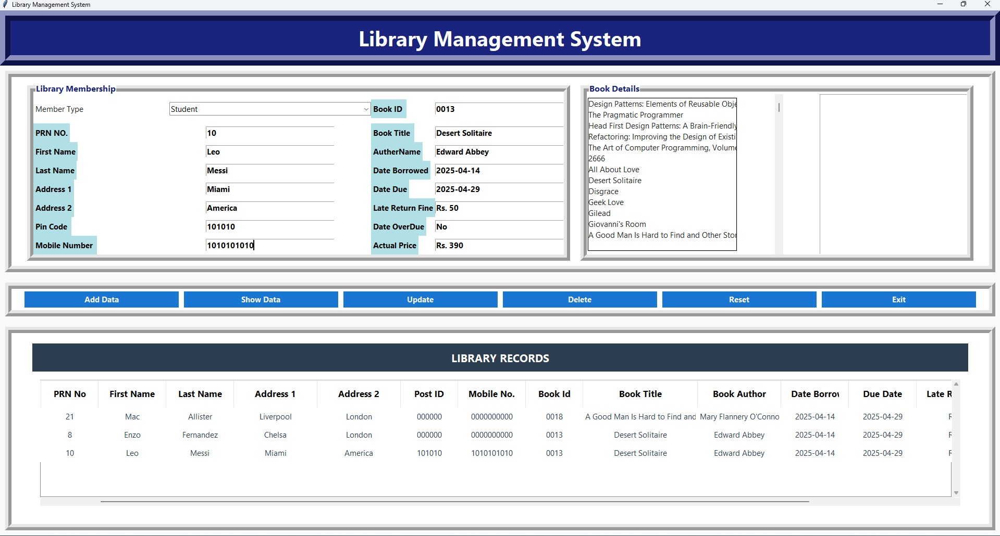

# Library Management System

A modern and user-friendly Library Management System built with Python and Tkinter. This application provides a complete solution for managing library operations including book tracking, member management, and borrowing records.





## Features

- **Modern User Interface**: 
  - Clean, minimalist design
  - Responsive layout
  - Professional color scheme
  - Sleek table design with alternating row colors
  - Easy-to-read headers and content

- **Member Management**: Add, update, and delete member information
- **Book Management**: Track book details including:
  - Book ID and Title
  - Author Information
  - Borrowing Status
  - Due Dates
  - Late Return Fines
- **Data Management**: 
  - In-memory data storage
  - Easy data entry and retrieval
  - Data validation and error handling

## Technical Details

- **Programming Language**: Python
- **GUI Framework**: Tkinter
- **Data Storage**: In-memory storage (no database required)
- **Dependencies**: 
  - tkinter (built-in)
  - datetime (built-in)

## UI Design

### Color Scheme
- **Background**: Clean white (#ffffff)
- **Headers**: Light gray (#e9ecef) with black text
- **Table Rows**: Alternating white and light gray (#f8f9fa)
- **Text**: Dark gray (#2c3e50) for content, black for headers
- **Selection**: Light gray (#e9ecef) with black text

### Typography
- **Headers**: Segoe UI, 12pt, Bold
- **Content**: Segoe UI, 11pt
- **Table Text**: Segoe UI, 11pt

### Layout
- Responsive design that adapts to window size
- Clean spacing and padding
- Professional table layout with proper column widths
- Easy-to-use form layout
- Clear visual hierarchy

## Installation

1. Ensure you have Python installed on your system
2. Clone this repository or download the source code
3. No additional installation required as all dependencies are built-in

## Usage

1. Run the application:
   ```bash
   python "Library Management System.py"
   ```

2. Main Features:
   - **Add Data**: Add new library members and book details
   - **Show Data**: Display member and book information
   - **Update**: Modify existing records
   - **Delete**: Remove records from the system
   - **Reset**: Clear all input fields
   - **Exit**: Close the application

3. Book Selection:
   - Select a book from the list to automatically populate book details
   - System automatically calculates due dates and fines

## Interface Components

1. **Member Information Section**:
   - Member Type (Admin Staff/Student/Lecturer)
   - PRN Number
   - Personal Details (Name, Address, Contact)
   
2. **Book Information Section**:
   - Book ID and Title
   - Author Information
   - Borrowing Details
   - Due Dates and Fines

3. **Action Buttons**:
   - Add Data
   - Show Data
   - Update
   - Delete
   - Reset
   - Exit

4. **Data Display**:
   - Modern table design with alternating row colors
   - Clear column headers
   - Easy-to-read content
   - Smooth scrolling
   - Row selection highlighting

## Error Handling

The system includes comprehensive error handling for:
- Invalid input data
- Book selection errors
- Data validation
- System operations

## Future Enhancements

Potential improvements for future versions:
- Database integration
- User authentication
- Report generation
- Book search functionality
- Member history tracking
- Export/Import functionality
- Advanced filtering options

## License

This project is open-source and available for educational and personal use.

## Author

Created as a learning project for Full Stack Development.
